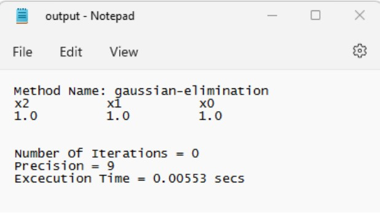
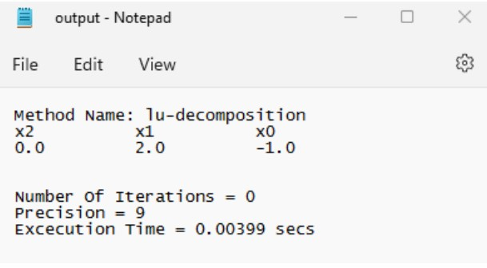
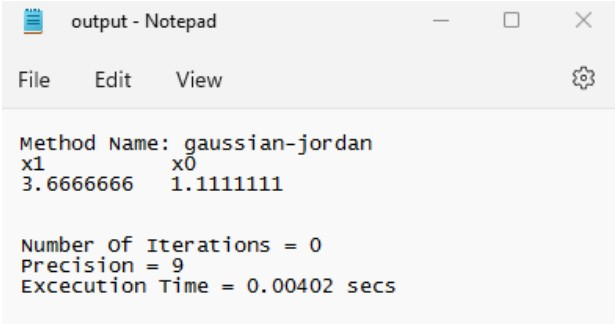
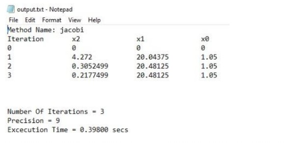
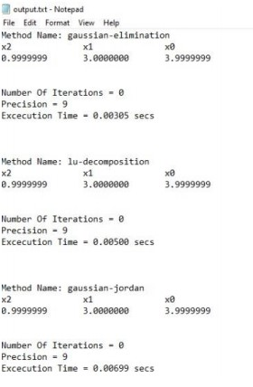
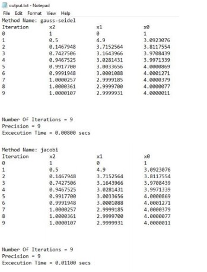
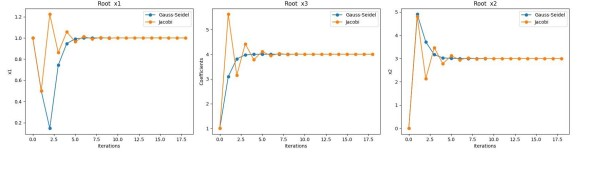

# Numerical-Methods-For-Solving-A-System-Of-Linear-Equations
Numerical-Methods-For-Solving-A-System-Of-Linear-Equations

## Analysis for the behavior of different examples:
❖ Gaussian Elimination
Example 1) 4*a-b+c-4
a+6*b+2*c-9
-1*a-2*b+5*c-2

❖ LU decomposition
Example) 1*a+1*b+1*c-1
3*a+1*b-3*c-5
1*a-2*b-5*c-1

❖ Gaussian Jordan
Example) 1x+3y-7
3x+4z-11

❖ Gauss Seidel
Example) 4*a-b+c-4
a+6*b+2*c-9
-1*a-2*b+5*c-2

❖ Jacobi
Example) 25a+5b-1c-106.8
-4.8b+2c+96.21
0.7c-0.735

❖ All methods at once
Example) 12x+3y−5z-1
x+5y+3z-28
3x+7y+13z-76
Initial val = [1 0 1]

